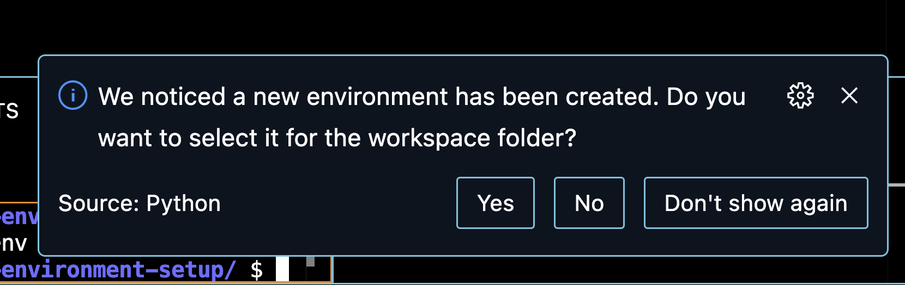
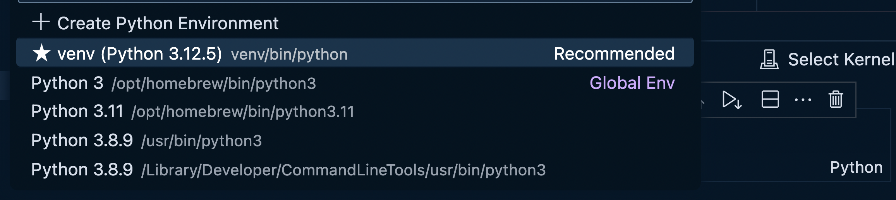
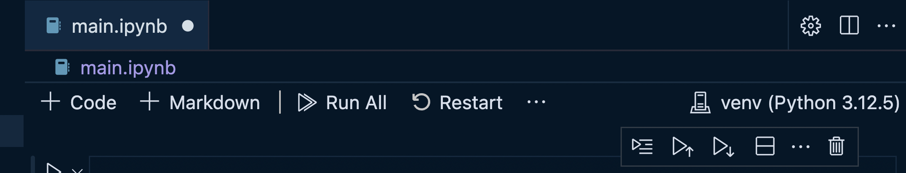
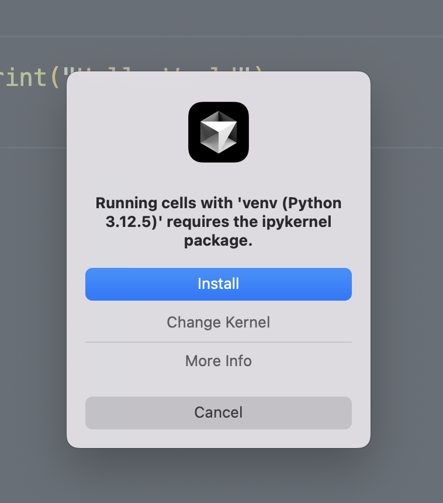

# PYTHON WORKSPACE SETUP

## VIRTUAL ENVIRONMENT SETUP

For Python projects whether Jupyter notebook `.ipynb` or a plain `.py` file, it's recommended to use a virtual environment for your workspace. This environment controls any packages you install into the workspace:

```bash
python3 -m venv venv
source venv/bin/activate
```

This creates a virtual environment named `venv` and activates it.

If you need to exit the virtual environment, you can do so by running:

```bash
deactivate
```
## WORKSPACE POPUP

You may see a modal popup asking you `...Do You Want to Select It for the Workspace Folder'




## KERNEL SELECTION

When working with a Python Workspace, it's crucial to select the correct kernel, which corresponds to your Python environment:


1. Look for the "Select Kernel" button in the top right corner of the notebook.


2. Choose `Python Environments` if you don't already see the option for your recommended `venv` (see above)

3. Click on it and choose the kernel that corresponds to your `venv` environment. It should be listed as something like "Python 3.x.x ('venv': venv)" and will often have 'Rec. (Recommended)' next to it.



After you select the kernel, you should see the venv environment in the top right corner of the notebook:



4. If you don't see your `venv` environment, you may need to restart VSCode or reload the window.

Selecting the correct kernel ensures that your notebook uses the Python interpreter and packages from your virtual environment, maintaining consistency with your project setup.

**NOTE**: When you first try to run code inside a Jupyter block or when you try to choose the kernel, you will most likely receive a popup saying that you must install `ipykernel`.

Choose `Install`

   